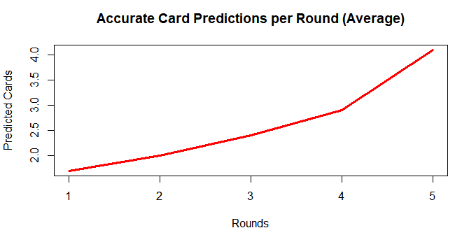

# Mastering Schnapsen by Means of Mathematical Abstraction and Tactical Decision Making
## Vrije Universiteit Amsterdam | Intelligent Systems 2019

### Abstract
This research paper investigates the performance of the intelligent agent “Mantis”, designed for the card game Schnapsen. The agent can predict the opponent’s hand by using permutation tables. 
We analyzed several plays of the game in order to determine how Mantis, our intelligent agent, can successfully predict the cards and how this information can be used to win the game, more specifically by playing against other bots that use different strategies.
We explain what Schnapsen consists of and what are the rules and plays on this “trick” game. Also, we state the skills and facts about the different intelligent agents used in the plays performed against our Intelligent Agent, Mantis, which are: Rand, Bully, Anti-Bully, and RDeep. Finally, we elaborate on the agents that may have had an effect on this project, such as Artificial Intelligence, Game theory or Decision making. 

**Keywords**: Computer Science, Schnapsen, Imperfect information, Game theory, Decision theory, Predictive Model, Artificial Intelligence, State Space Search, Uninformed search, Intelligent agents, Bots, Tree search, Sims tables, Permutation tables, Mathematical Abstraction

## 1. Introduction
Over the last three decades, the field of Artificial Intelligence, and specifically the branch of Intelligent Systems was not only able to reach remarkable goals, but it has also become a part of everyday life: from the “pure” scientific field, such as Remote Agent, which was able to manage a spacecraft domain [5], to more “simple” systems, such as modern thermostats, and even in popular culture. Intelligent Systems have an effect on everyday life and they are becoming more and more useful for society. 
Another common field where Intelligent Systems can be applied on is games. Even if it may not sound as astounding, games represent an excellent example to thoroughly understand the basics of Intelligent Systems. Among the many ways that they can be used to develop such systems, we have the group represented by Rational Agents, which can be implemented using four main different approaches: model-based reflex agents, utility-based agents, goal-based agents, and simple reflex agents [6]. 
In this paper, we are going to focus on model-based agents, in particular, those that can be developed using game theory, which “[...] was introduced in the last century by mathematicians and economists as a tool to analyze both economic competition and political conflicts.”[9]
Moreover, as described by Wooldridge [7], in game theory, a game can be considered “an abstract mathematical model of a multi-agent decision-making setting”
When speaking about decision theory, as Parsons and Woolridge [8] defined:  “Decision theory [A] is a means of analyzing which of a series of options should be taken when it is uncertain exactly what the result of taking the option will be.”
This theory focuses on choosing the most optimal decision, depending on the context of the expectation of what optimal could be in a certain case. Decision theory analyzes a given scenario and searches for the best solution in any given situation.
Game theory studies situations in which different agents could have an effect, also in an “unstable environment” where the situation could be affected by the different participating agents, it analyzes the way the agents could perform in the different cases or phases of what the game theory could be taking part in, it always takes into account what could affect the situation or alter it, and in the way that this relates to decision theory is that both theories could be or are affected by the decisions the other participants or agents could make in a situation.

## 2. Schnapsen
Schnapsen is a two-player trick-playing card-based strategy game [1]. The aim of the game is for each player to surpass his opponent's points or be the first one to reach a total of 66 points.
There is a number of variants to Schnapsen, however, in our version, a deck consists of the five highest valued cards of every suit (e.g. 10, J, Q, K, A). Hence, the deck consists of a total of 20 cards.
The game begins with the top card of the stock getting revealed to both players as the trump card, which we will discuss in more detail later on. Each player then draws 5 cards, which are hidden from their opponent. To begin a new round, each player plays one of their cards in the trick and the card with the highest value wins the trick. A card with the same suit as the trump card is considered higher value than any of the other cards. For example, if the trump card suit is ‘Spades’, then a ‘10 of Spades’ will always win over an ‘Ace’ of any other suit. The winner of the trick receives the sum of the points from the trick (Aces = 11, Ten = 10, King = 4, Queen = 3 and Jack = 2), each player restores their hand back to 5 cards by drawing from the stock and the next trick can then be played.
A player can also perform some special moves [1], namely a “marriage” or a “trump-jack exchange”. A “marriage” can be performed when a player has both the Queen and the King of the same suit. The player then shows the two cards and plays one of them, resulting in the trick gaining an additional 20 points for the winner, increased to 40 if the Queen and King are of the trump suit. Moreover, a “trump-jack exchange” can be performed only if a player holds the trump jack. They can then switch the trump jack with the current trump prior to any other actions. An additional rule is that when the stock runs out of cards, then both players have to make their cards known.

## 3. Research question
In this paper, we attempt to answer the question if we can approximate a perfect information game through means of informed predictions and mathematical abstraction, which are reinforced by Sims tables and permutation sets. We also try to prove whether this strategy can be applied in-game and how efficient it can be, by applying different methods. 

## 4. Intelligent Agents
### 4.1 Mantis
When we observed how human players play card games, we noticed that they usually tend to play around the cards that have not been observed yet and have a moderately high chance of being played. As mentioned by Wisser [2], expert players are able to consider “multiple partially fixed worlds across the possibilities” and they can perceive, which world would be most likely to win them the game. Advanced players usually have a better, informed guess due to the experience factor resulting in a minimum 10 world prediction.
Our bot, which we called mantis after the Greek word for prophet, is an intelligent predictive agent which attempts to do just that. It creates the entire state space tree and then searches for the highest probable opponents hand. Under normal circumstances, the time complexity of an algorithm that traverses the entire state space would be too large, however, this can be done more efficiently with the use of a variant of permutation tables, mentioned by Sims [3]. Sims tables are an algebraic abstraction that helps us in the organization of all the different worlds.
Each world consists of a different permutation of the opponent possible hand as a tuple of five cards. Therefore, our Sims table contains every possible world in a tuple format, as described by Knuth [5]. We further simplify the cards by representing their suit and rank as a single integer, the card’s index. We then trim our data by removing repeating worlds as the order of the cards is no longer needed in our calculations.
During run-time, whenever a card is revealed - either when the trump-card is shown, when we receive cards or when a card is played by the opponent - the algorithm will update the Sims table by removing the subset of worlds where an instance of the observed card exists in.
To predict the opponent's hand, a list of all unseen cards is compared to our permutation table and the sum of worlds, where an instance of that specific card is observed in, is calculated. This value is then divided by the total number of worlds in the permutation table and appended to a probability matrix as a tuple of an integer and a float, which represent the card index and the probability of the card being in the opponent's hand respectively. Finally, the probability matrix is sorted and the five most probable cards are selected as a prediction to the opponent's hand.

### 4.2 Rand
The Rand bot uses a very simple strategy: after evaluating all the possible legal moves, it plays a card randomly, without taking into account any other information about the game, such as trump cards or whether or not it will win or lose the trick. 

### 4.3 Bully
The Bully bot applies a simple strategy, it always plays the card with the highest possible value e.g. it will always play a trump card if available. If it has no trump cards left, Bully will make sure to match the opponents played card suit.

### 4.4 Anti-Bully
The Anti-Bully is a smarter version of Bully: instead of throwing the highest card it plays the card with the lowest that is required to beat the opponent hand. Anti-Bully still evaluates the trump cards and the leading suit.

### 4.5 RDeep
The RDeep Bot uses Perfect-Information Monte-Carlo Sampling: this algorithm assumes that we have perfect information about the state of the game. It then plays a number of games randomly, averages the results and chooses the best move.

## 5. Test system
To test out our intelligent agent ‘Mantis’, we made a number of tests to evaluate the accuracy of the prediction, the consistency of correct predictions as well as the increase in potential performance when combined with an independent bot. It is essential to note, that our predictive model only predicts the opponent potential hand, however, it needs to be combined with another bot in order to be able to make use of these newly acquired insights.
In the first experiment, we will play out 10 games and manually compare the number of correct predictions per round. Since in Schnapsen the number of rounds is not fixed we decided to stop games after the 5th round as the number of possible worlds after this round is always under 1000 and thus further calculations are negligible.
Likewise, we will use the same 10 games to evaluate the consistency of our bot by calculating the mean number of the total cards accurately predicted for each independent game.
	For the third experiment, we will use our intelligent agent in combination with the bot Anti-Bully. We will then compare this bot with some of the other bots that we know can play above average in a tournament of 50 games each. Namely, these agents will be Bully and RDeep.

## 6. Results
The following graph shows the accuracy of the card predictions made by ‘Mantis’ per round. On the x-axis, we can see the individual rounds and on the y-axis the number of cards accurately predicted. Every round is averaged throughout all 10 games - for a breakdown of all 10 games check appendix A, figure I - and then plotted in the aforementioned coordinate axis.

 
